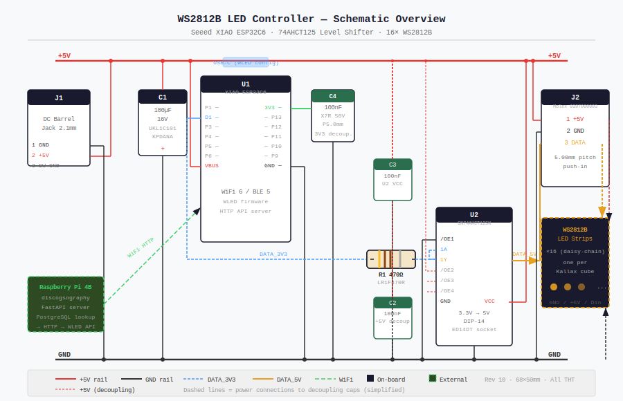
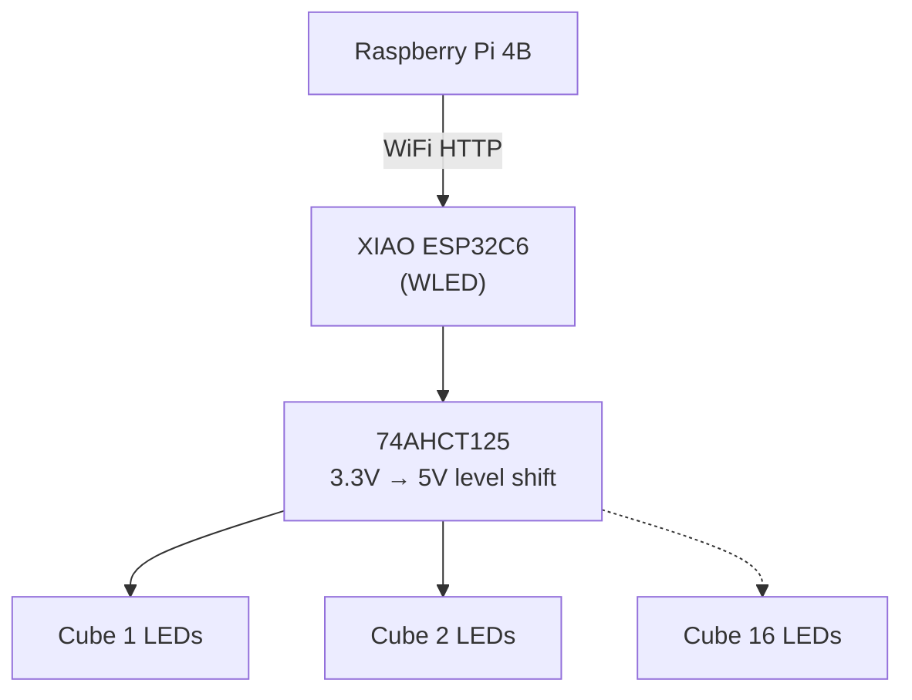
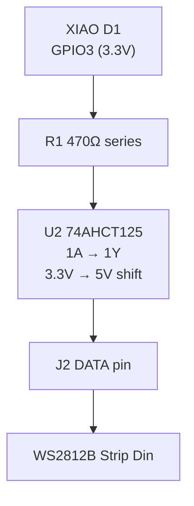
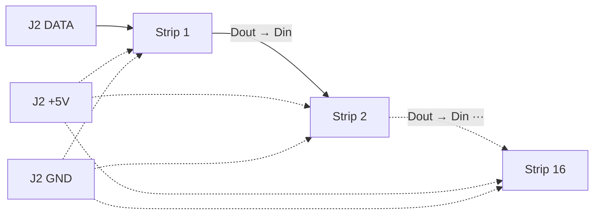
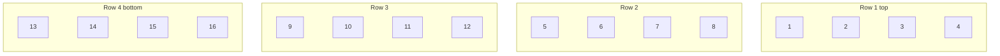

# WS2812B LED Controller — Vinyl Record Shelf Finder

PCB for the hardware layer of [discogsography](https://github.com/SimplicityGuy/discogsography): a system that illuminates the correct cube of a Kallax 4×4 shelf when you look up a vinyl record.



## Overview

A Raspberry Pi 4B queries a PostgreSQL database for a record's shelf location, then fires an HTTP call to WLED running on a Seeed XIAO ESP32C6. The ESP32C6 drives the correct WS2812B LED strip, lighting up the cube containing that record.

```
Raspberry Pi 4B ──WiFi HTTP──▶ XIAO ESP32C6 (WLED)
                                      │
                              74AHCT125 (3.3V→5V)
                                      │
                    ┌─────────────────┼──────────────────┐
                    ▼                 ▼                   ▼
               Cube 1 LEDs    Cube 2 LEDs  ···    Cube 16 LEDs
```



## PCB Specifications

| Parameter | Value |
|---|---|
| Dimensions | 68 × 50 mm |
| Layers | 2 (F.Cu, B.Cu) |
| Min trace width | 0.25 mm (signal) / 1.0 mm (power) |
| PCB thickness | 1.6 mm |
| Surface finish | ENIG (OSH Park) |
| Assembly | All through-hole, hand solderable |
| Mounting | 4 × M3 corner holes, 10 mm standoffs |
| Connectors | Top edge: USB-C (XIAO), DC barrel jack, LED terminal block |

## Schematic

The signal path:

```
XIAO D1 (GPIO3, 3.3V)
    │
   R1 470Ω
    │
U2 74AHCT125 1A → 1Y (3.3V → 5V level shift)
    │
J2 terminal block DATA pin → WS2812B strip Din
```



Power:
- 5V in via J1 (CUI PJ-102AH barrel jack, centre positive)
- 5V rail shared between LED strips (via J2) and XIAO VBUS
- 3.3V generated by XIAO's onboard regulator → decoupled by C4

## Bill of Materials

See [BOM.csv](docs/BOM.csv) for the full sourced BOM with DigiKey part numbers.

| Ref | Part | Description | Qty |
|---|---|---|---|
| U1 | XIAO-ESP32-C6 | Seeed XIAO ESP32C6 module | 1 |
| U2 | SN74AHCT125N | 74AHCT125 level shifter, DIP-14 | 1 |
| — | ED14DT | On Shore DIP-14 socket | 1 |
| C1 | UKL1C101KPDANA | Nichicon 100µF/16V electrolytic, P3.5mm | 1 |
| C2, C3, C4 | K104K15X7RF53H5G | Vishay KG 100nF X7R, 50V, P5.0mm | 3 |
| R1 | LR1F470R | TE 470Ω ¼W axial, P7.62mm | 1 |
| J1 | PJ-102AH | CUI DC barrel jack 2.1mm right-angle | 1 |
| J2 | 0397000803 | Molex 3-pos Eurostyle terminal block 5.00mm | 1 |
| MH1–4 | — | M3 × 6mm screws + 10mm brass standoffs | 4 |

## LED Strip Wiring

16 × WS2812B strips (one per Kallax cube). All strips share the 5V/GND power bus. Data is a single daisy-chain through all 16.

```
J2 +5V ──────────────────────── ●  ●  ●  ... ●   (all 16 strip +5V pads)
J2 GND ──────────────────────── ●  ●  ●  ... ●   (all 16 strip GND pads)
J2 DATA → Strip1 Din
           Strip1 Dout → Strip2 Din
                          Strip2 Dout → ... → Strip16 Din
```



Cube numbering (top-left = 1, bottom-right = 16, row-major):

```
┌────┬────┬────┬────┐
│  1 │  2 │  3 │  4 │  ← Row 1
├────┼────┼────┼────┤
│  5 │  6 │  7 │  8 │  ← Row 2
├────┼────┼────┼────┤
│  9 │ 10 │ 11 │ 12 │  ← Row 3
├────┼────┼────┼────┤
│ 13 │ 14 │ 15 │ 16 │  ← Row 4
└────┴────┴────┴────┘
```



## WLED Configuration

| Setting | Value |
|---|---|
| LED type | WS2812B |
| Data pin | GPIO3 (D1) |
| Total LEDs | 16 × (LEDs per strip) |
| Segments | 16 (one per cube, equal length) |
| Color order | GRB |
| Voltage | 5V |

Each cube maps to one WLED segment. The discogsography API sends a HTTP request to activate the segment corresponding to the record's cube location.

## J1 Barrel Jack Pinout

| Pin | Function | Note |
|---|---|---|
| 1 (sleeve, square pad) | GND | |
| 2 (tip) | +5V | Centre positive |
| 3 (switch, side) | GND | Tied to GND on PCB |

⚠️ **Centre positive only.** Verify polarity with a multimeter before first power-up.

## J2 Terminal Block Pinout

| Pin | Signal | Wire colour |
|---|---|---|
| 1 (square pad) | +5V | Red |
| 2 | GND | Black |
| 3 | DATA (5V logic) | Yellow |

## Assembly

See [ASSEMBLY.md](docs/ASSEMBLY.md) for the full step-by-step guide covering PCB population, LED strip installation, wiring, and system test.

**Soldering order (shortest to tallest):**
1. R1 (470Ω axial)
2. C2, C3, C4 (100nF ceramic disc)
3. C1 (100µF electrolytic — observe polarity)
4. ED14DT DIP socket (not the IC)
5. J1 barrel jack
6. J2 terminal block
7. XIAO female socket headers (1×7 × 2)
8. SN74AHCT125N into socket (after power test)
9. XIAO ESP32C6 module

## Fabrication

Designed for [OSH Park](https://oshpark.com) 2-layer service. Upload `controller/ws2812b_controller.kicad_pcb` directly.

To generate gerbers in KiCAD 7:
1. Open `controller/ws2812b_controller.kicad_pcb`
2. File → Fabrication Outputs → Gerbers
3. Output to `controller/gerbers/`
4. Also generate drill files from the same dialog

## Software

WLED firmware is flashed to the XIAO ESP32C6 before installation. The shelf-finder integration lives in the main [discogsography](https://github.com/SimplicityGuy/discogsography) repository — specifically the `cube_locations` table and `/api/shelf/find` endpoint in the FastAPI service.

## Licence

Hardware designs released under [CERN OHL-P v2](LICENSE).
