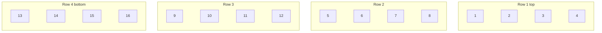

# Assembly Instructions

WS2812B LED Controller — Vinyl Record Shelf Finder  
PCB rev 10 · 68 × 50 mm · All through-hole

---

## Tools Required

- Temperature-controlled soldering iron (set to 320–350°C)
- 63/37 or no-clean solder
- Flux pen
- Solder wick / desoldering pump
- Multimeter
- Wire strippers, side cutters
- Flat-head screwdriver (for J2 terminal block)
- M3 screwdriver
- Isopropyl alcohol + brush (flux cleanup)
- PCB holder / helping hands

---

## Part 1 — PCB Assembly

Solder in order of component height, shortest first.

### Step 1 — PCB Preparation

1. Inspect all holes — confirm they are clear.
2. Install four M3 brass standoffs up through the bottom of MH1–MH4 and finger-tighten from above. This is much easier before the board is populated.
3. All components mount on the **top face (F.Cu)**.

### Step 2 — R1: 470Ω Axial Resistor (LR1F470R)

1. Bend leads to 7.62mm pitch.
2. Insert into R1 — not polarised, either orientation.
3. Tape or bend leads to hold flat, solder from the bottom, clip leads.

### Step 3 — C2, C3, C4: 100nF Ceramic Disc (K104K15X7RF53H5G)

These use H5-style flat-crimp leads at exactly **5.0mm pitch** — do not bend them.

1. Insert each cap — not polarised.
2. Solder from the bottom, clip.
3. Verify C4 (between J1 and the XIAO area) has visible clearance from J1 before soldering.

### Step 4 — C1: 100µF Electrolytic (UKL1C101KPDANA)

> ⚠️ **Polarised.** Installing backwards will cause failure on power-up.

1. The **longer lead is positive (+)**.
2. The **white stripe on the sleeve marks the negative side**.
3. Insert with the positive (long) lead into the **square pad** (marked `+` on silkscreen).
4. Solder and clip.

### Step 5 — ED14DT DIP Socket (for U2)

> ℹ️ Solder the **socket**, not the IC. The IC goes in after the power test.

1. Insert the ED14DT socket into U2 footprint.
2. The **notch** on the socket = pin 1. Align with the **square pad** (top-left of U2 outline on silkscreen).
3. Tack two diagonal corners, verify alignment, solder all 14 pins.

### Step 6 — J1: Barrel Jack (PJ-102AH)

1. Insert J1 so the barrel protrudes above the top board edge.
2. Pin 3 (switch) sits on the **left** side of the connector (away from J2).
3. Solder all three pins. The sleeve/GND pad (pin 1, square) carries all return current — use a generous solder fillet.

### Step 7 — J2: Terminal Block (Molex 0397000803)

1. Insert J2 so the push-button wire openings face **up and outward** beyond the top board edge.
2. Pin 1 (square pad) is on the **left** — labelled `+5V` on silkscreen.
3. Pin order left to right: `+5V` · `GND` · `DAT`.
4. Solder all three pins.

### Step 8 — XIAO Socket Headers

The XIAO ESP32C6 module plugs into two 1×7 female socket headers. The module is **not** soldered.

1. Insert both headers into U1L (left) and U1R (right). Pin 1 of each (square pad) is at the top.
2. **Use the XIAO module as an alignment jig** — press it gently into both headers before soldering to guarantee perfect spacing.
3. Solder one pin of each header, verify alignment, then solder the rest.
4. Remove the XIAO module.

### Step 9 — Flash WLED, Then Install XIAO

1. Flash WLED firmware onto the XIAO while it is loose (easier than in-board).
2. Complete initial WLED Wi-Fi setup.
3. Orient the XIAO with USB-C toward the top board edge (`USB-C ↑` silkscreen label).
4. Press firmly and evenly into both socket headers until fully seated.

### Step 10 — Pre-Power Checks

1. Visual inspection — look for solder bridges especially on the ED14DT socket.
2. With **no power applied**, measure resistance between `+5V` and `GND` on J2. Should be > 1kΩ. Near-zero = bridge.

### Step 11 — First Power-Up

> ⚠️ Verify the supply is **centre-positive** before plugging into J1.

1. Plug in the 5V supply.
2. Measure `+5V` vs `GND` at J2 → should read 4.9–5.1V.
3. Measure `3V3` vs `GND` at U1R pin 1 → should read 3.2–3.4V.
4. If either reading is wrong, disconnect and diagnose before continuing.

### Step 12 — Install SN74AHCT125N

1. Only after voltages check out.
2. Align the **notch on the IC** with the **notch on the ED14DT socket** (both point toward the top edge).
3. Press firmly and evenly across the full width — confirm all 14 pins seat correctly.

---

## Part 2 — Shelf Installation

### Step 13 — Cut and Label LED Strips

Cut 16 strips, one per Kallax cube, approximately 300mm each. Cut only at the copper pad marks between LED packages.

Label strips 1–16 before installation:

```
Row 1 (top):    1   2   3   4
Row 2:          5   6   7   8
Row 3:          9  10  11  12
Row 4 (bottom):13  14  15  16
```



Pre-tin the three solder pads on each cut end.

### Step 14 — Mount Strips in Cubes

1. Wipe the back wall of each cube with isopropyl alcohol and allow to dry.
2. Adhere the strip horizontally along the back wall, LEDs facing outward.
3. Supplement adhesive with hot glue at each end if needed (Kallax surfaces can be waxy).
4. Feed wires out through the back of the shelf. Drill a 6mm hole in the back panel corner if needed.

### Step 15 — Wire the Power Bus

Run a **red wire** (+5V) and **black wire** (GND) from J2 to every strip in **parallel**. Solder at each strip pad. Cable-tie the bus every 150mm.

### Step 16 — Daisy-Chain the Data Line

Run **yellow wire** from J2 pin 3 (DATA) to strip 1's `Din` pad. Then:

```
J2 DATA → Strip 1 Din
           Strip 1 Dout → Strip 2 Din
                           Strip 2 Dout → ... → Strip 16 Din
```


The arrow on the WS2812B strip indicates the data direction — always `Dout → Din`.

> ⚠️ Follow the cube numbering order (1→16) precisely. WLED segment mapping relies on physical chain order.

Insulate all exposed solder joints with heat-shrink tubing.

### Step 17 — Mount PCB

1. Hold the PCB in the intended position on the back of the shelf (above cube row 1, accessible from the top).
2. Mark four M3 hole positions using the PCB as a template.
3. Drill 3.5mm holes through the Kallax back panel.
4. Fasten PCB with M3 × 6mm screws through the board into the standoffs.

### Step 18 — Final Connections

1. **J2** — Insert the three bus wires. Press the orange push-button above each terminal to open, insert stripped wire (9–10mm), release. Pull gently to confirm grip.
2. **J1** — Plug in the 5V supply barrel. Confirm centre-positive.
3. **Raspberry Pi** — joins over Wi-Fi; no physical PCB connection needed.

### Step 19 — System Test

1. Apply power. WLED should boot and appear on Wi-Fi.
2. In WLED, set LED count to total LEDs across all strips. Set solid white — verify all 16 cubes light.
3. Create 16 equal segments. Activate each in turn and confirm correct cube illuminates (cube 1 = top-left, cube 16 = bottom-right).
4. Measure supply current at full white brightness. Confirm it is within your PSU rating.
5. Update the `cube_locations` table in the discogsography database with each record's cube assignment.

---

## Connector Quick Reference

**J1 — DC Power In (PJ-102AH)**

| Pin | Signal |
|---|---|
| 1 — sleeve (square pad) | GND |
| 2 — tip | +5V (centre positive) |
| 3 — switch (side) | GND (tied on PCB) |

**J2 — LED Strip Out (Molex 0397000803)**

| Pin | Signal | Wire |
|---|---|---|
| 1 — square pad | +5V | Red |
| 2 | GND | Black |
| 3 | DATA (5V) | Yellow |

**U1 — XIAO Socket (key pins)**

| Position | Signal |
|---|---|
| U1L pin 2 | D1 / GPIO3 → DATA_3V3 |
| U1L pin 7 | VBUS / +5V |
| U1R pin 1 | 3V3 |
| U1R pin 7 | GND |

---

## Estimated Build Times

| Phase | Time |
|---|---|
| PCB population (all through-hole) | 45–60 min |
| LED strip cutting and pre-tinning | 30 min |
| Cube installation (16 cubes) | 45–60 min |
| Wiring (power bus + data chain) | 30–45 min |
| PCB mounting and final connections | 15 min |
| System test | 15 min |
| **Total** | **~3.5 hours** |
